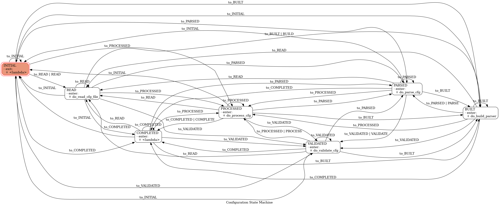

# TRD State Diagrams

## Launch life cycle:


## Launch life cycle (with auto transitions):


## Configuration life cycle:


## Configuration life cycle (with auto transitions):



## Diagram generation
To generate the state diagrams install graphviz:

```bash
sudo apt install graphviz
```

and import `GraphMachine` into TransitionsFsmBuilder.py and replace it with the actual machine instance and run trd normally.

```python
from transitions.extensions import GraphMachine as Machine
```

For more please check the [transitions diagram documentation](https://github.com/pytransitions/transitions#-diagrams).