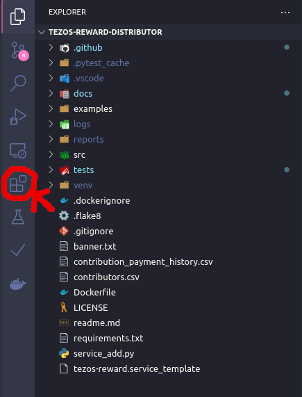
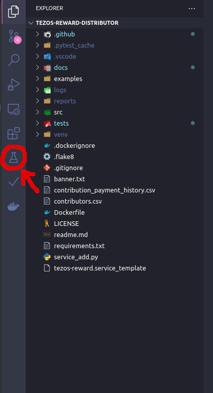
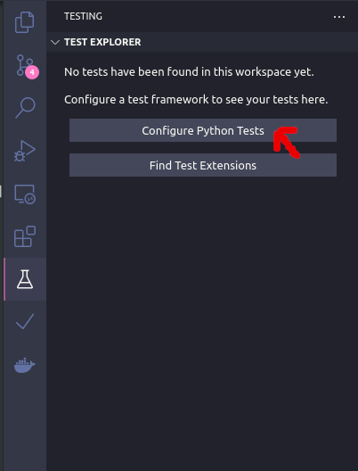
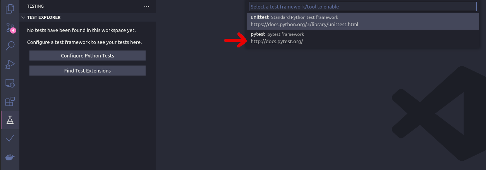
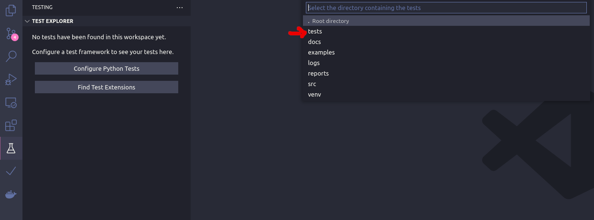
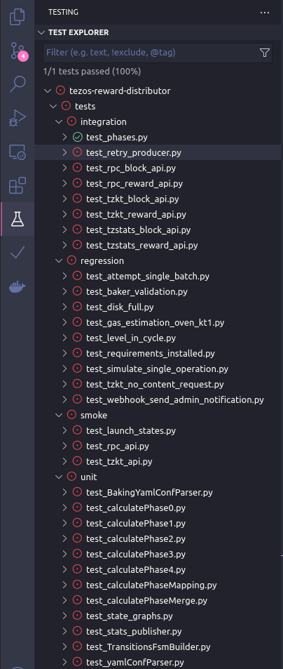
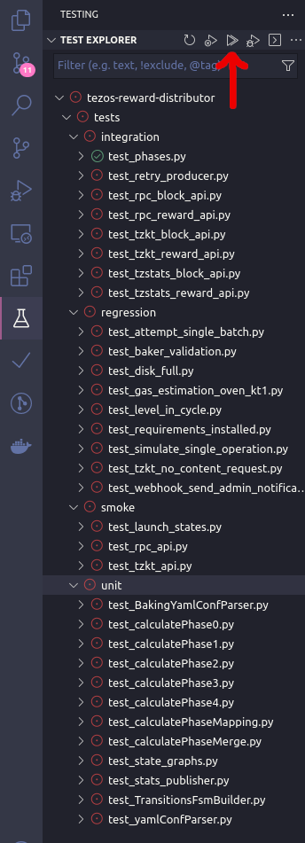

Tests
========
In order to run test which rely on the TZPRO API you have to copy the `.env.example` file to `.env` and add your personal TZPRO API Key.

Test Execution
---------------
To run the tests locally you need to have `pytest <https://pypi.org/project/pytest/>`_ installed. It is already part of the `requirements_developers.txt` file. You can run the tests via:
::

    pytest tests/

Structure
--------------

The tests which are executed in TRD are as follows:

1. unit tests

2. regression tests

3. integration tests

4. smoke tests

5. acceptance tests (WIP)

6. non functional tests. (WIP)

7. formal verification (WIP)

Unit tests
--------------
Unit tests test only one specific function or method of a class. 
The smaller the function and the more specialized it is the better the unit test.

Regression tests
------------------
Regression tests are tests which document fixed bugs.
To implement a regression test you need to do the following:

1. Have a bug in trd (see bug label in issues)

2. Reproduce the bug in a test under the `regression/` directory.

3. Assert the behaviour which you would like this bug to have.

4. Fix the bug and make the test pass.

Integration tests
-------------------
Integration tests test the behaviour of trd. Meaning it tests the interaction between multiple functions or classes.

Smoke tests
-------------------
Smoke tests test if trd starts, runs and ends under different cirumstances.

Acceptance test (WIP)
-----------------------
Acceptance tests test the functionality which users are expecting to work. 
E.g. the correct and reliable distribution of rewards.

Non functional tests (WIP)
---------------------------
Non functional tests test the performance, load time, transaction speed etc. of trd.

Verification (WIP)
-------------------
Checking the FSM model systematically with exhaustive exploration. 
This consists of exploring all states and transitions in the model (`source`_).

Test Format
-------------
Name the test file according to the feature/function you want to test and the "test\_" prefix (e.g. test_sample.py).
Only use functions to write the actual tests for simplicity. 
If applicable make use of pytest's fixtures to avoid code duplication.
Check the `pytest documentation and tutorials <https://docs.pytest.org/en/7.1.x/contents.html>`_ for more info on how to write pytest tests.

Visual Studio Code Test Execution (optional)
----------------------------------------------

If you are using `Visual Studio Code <https://code.visualstudio.com/>`_, then copy this into your settings:

.. code-block:: json
   {
       "python.testing.pytestArgs": [
           "tests"
       ],
       "python.testing.unittestEnabled": false,
       "python.testing.pytestEnabled": true,
       "python.envFile":   "${workspaceFolder}/.env",
       "esbonio.sphinx.confDir": ""
   }

In addition you want to use it with the extensions installed in the previous section and check them here:

Then click on the test icon tab

Click on Configure Python Tests

Select pytest

Select the test folder

Now you can see all the test which are runnable

Now run all tests

.. _source: https://en.wikipedia.org/wiki/Formal_verification
